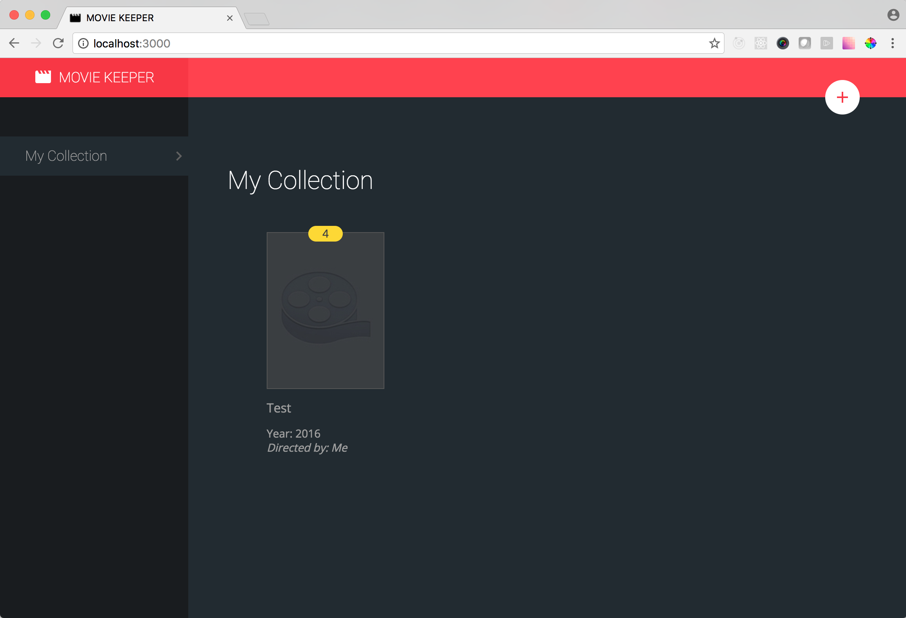
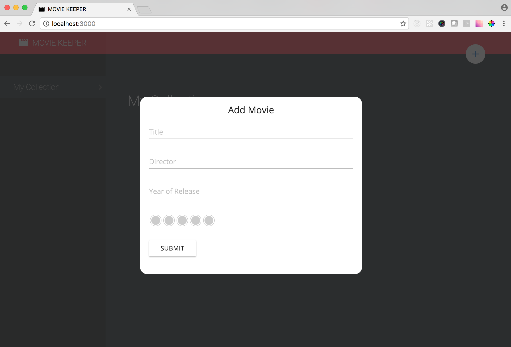

# movie keeper

## setup

1. install node v4.3+ [https://github.com/creationix/nvm](https://github.com/creationix/nvm)
2. `npm i -g npm` (update npm to latest version)
3. `cd path/to/movie-keeper`
4. `npm i`
5. `npm start`

## Screenshots

